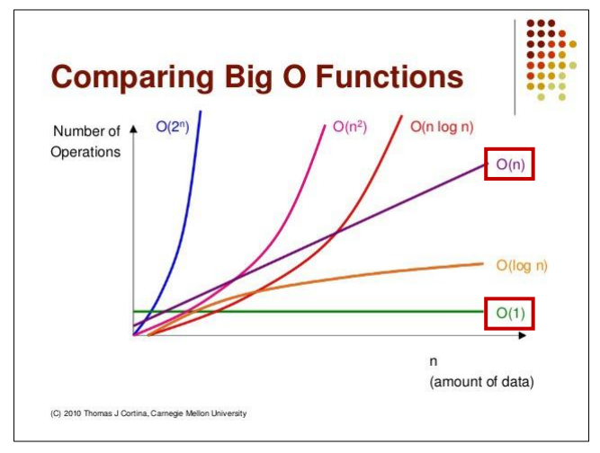

#  시간 복잡도

안에서 연산이 적게 일어나서 빨리  나오는 코드가 좋은 코드

- 기본연산
    - 단위시간 1이 소요되는 연산
    - 기본연산의 총 횟수 == 알고리즘 소요 시간

시간 복잡도 (Time Complexity)
- 계산 복잡도 이론에서 시간 복잡도는 문제를 해결하는데 걸리는 시간과 입력의 함수 관계를 가리킨다.

##  빅오 표기법
**입력 n이 무한대로 커진다고 가정하고 시간 복잡도를 간단하게 표시하는 것**
최고차항만 남기고 계수와 상수 제거
매 입력에 따라 정확한 수식을 구하는 것은 불필요
정확한 수치보다는 **증가율**

** - O(1):** 단순 산술 계산(덧셈, 뺄셈, 곱셉, 나눗셈)
     - 단순계산 >+,*
** - O(logN):** 크기 N인 리스트를 반절씩 순회/탐색
     - 이진탐색, 분할정복
 **- O(N):** 크기 N인 리스트를 순회
     -  리스트 순회, 1중 for문
 **- O(NlogN)****:** 크기 N인 리스트를 반절씩 탐색 * 순회
     - :높은 성능의 정렬(Merge/Quick/Heap Sort)
 -** O(N^2): **크기 M, N인 2중 리스트를 순회
     - 2중 리스트 순회, 2중 for문
 **- O(N^3)**: 3중 리스트를 순회
     -  3중 리스트 순회, 3중 포문
 - **O(2^N)**:크기 N 집합의 부분 집합
     - 크기가 n인 집합의 부분 집합
 -** O(N!)**: 크기가 N인 순열

문제에서 초단위 시간제한이 주어지고 1초에 1억번 연산 가능하다

